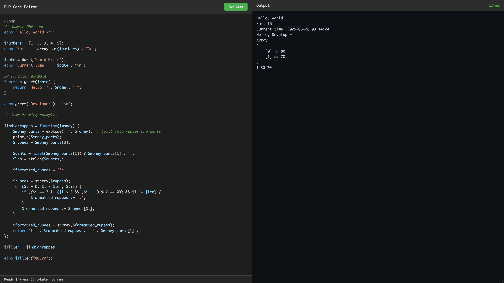

# PHP Sandbox Playground

This project is an outcome of my love towards two things:

1. [Tehplayground](https://www.tehplayground.com/)
2. [Cloudflare](https://developers.cloudflare.com/)

Since the introduction of [Cloudflare Containers](https://developers.cloudflare.com/containers/), I was searching for a valid usecase. And as they mentioned about **Sandboxed environment**, immediate thing which striked my mind was Tehplayground. I love that tool and it is a crucial part of my workflow whenever I code in PHP.

## Getting Started

Clone this repo. Just run `npm install` followed by `npm run dev` in that directory. Thats it, your code runner is ready!

Open [http://localhost:8787](http://localhost:8787) with your browser to see the result.

## Deployment

You may need a paid workers plan for deploying. If you already have one, just run `npm run deploy`.

## Learn More

To learn more about Containers, take a look at the following resources:

- [Container Documentation](https://developers.cloudflare.com/containers/) - learn about Containers
- [Container Class](https://github.com/cloudflare/containers) - learn about the Container helper class

Your feedback and contributions are welcome!
